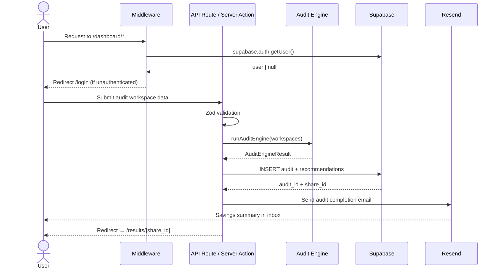
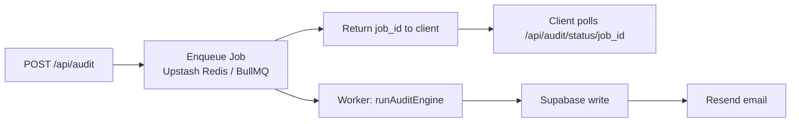

# Credex — System Architecture

## Overview

Credex is a production-grade AI spend optimization tool with a dual architecture: a **free public audit tool** (no login required) and an **optional authenticated dashboard** for power users.

The core audit functionality is completely public — users can run audits, see results, and share reports without creating an account. Authentication is only required for advanced features like audit history, team management, and recurring monitoring.

The architecture is built around five principles:

- **Public-first** — the main audit flow requires zero authentication; email captured AFTER value shown
- **Explainability** — every recommendation traces back to a named rule and a concrete savings formula
- **Security** — all sensitive keys and audit logic run server-side only
- **Low operational complexity** — managed infrastructure (Vercel + Supabase + Resend) over self-hosted services
- **Horizontal scalability** — stateless API layer, lightweight rule evaluation, queue-ready design

---

## High-Level System Diagram

```mermaid
graph TD
    A[Browser / Client] -->|HTTPS| B[Next.js App Router\nVercel Edge]

    B --> C{Route Type}

    C -->|Public audit form| H[/audit-form\nNo Auth Required]
    C -->|Public results| F[/results/[id]\nNo Auth Required]
    C -->|Protected dashboard| D[Middleware\nSupabase Auth Check]
    C -->|API Routes| E[API Layer]

    H --> E
    D -->|Authenticated| E
    D -->|Unauthenticated| G[Redirect → /login]

    E --> I[Validation Layer\nZod]
    I --> J[Audit Engine\nDeterministic Rules]
    I --> K[Anthropic API\nNarrative Generation]
    I --> L[Resend\nTransactional Email]

    J --> M[(Supabase\nPostgreSQL + RLS)]
    K --> M
    L --> N[User Inbox]

    M --> F
    F --> A
```

**Key architectural decision:** The primary user flow (`/audit-form` → `/results/[id]`) bypasses authentication entirely. This matches the assignment requirement: "No login required to use the tool. Email is captured after value is shown, never before." 

Authentication routes (`/login`, `/signup`, `/dashboard`) exist for future features (audit history, team management, recurring monitoring) but are NOT part of the core audit flow.

---

## Request Lifecycle



---

## Audit Engine Architecture

The audit engine is the core of Credex. It is entirely deterministic — no LLM is involved in generating the financial recommendations themselves.

### Internal Flow

```mermaid
graph LR
    A[WorkspaceMetrics[]] --> B[Provider Router\nswitch on provider]

    B --> C[ChatGPT Rules\n3 rules]
    B --> D[Claude Rules\n2 rules]
    B --> E[Cursor Rules\n2 rules]
    B --> F[Copilot Rules\n2 rules]
    B --> G[Gemini Rules\n2 rules]
    B --> H[Universal Rules\n2 rules per provider]

    C & D & E & F & G & H --> I[Merge All Recommendations]

    I --> J[Deduplicate by ruleId]
    J --> K[Sort: Critical → High → Medium → Low\nthen by annualSavings desc]
    K --> L[Compute Totals\n+ optimizationScore]
    L --> M[AuditEngineResult]
```

### Rule Evaluation

Each provider has its own rule function. Rules are pure functions — they take a `WorkspaceMetrics` object and return `AuditRecommendation[]`. No side effects, no I/O.

```
WorkspaceMetrics
  ├── provider
  ├── totalSeats / activeSeats30d / inactiveSeats30d
  ├── avgPromptsPerUser / avgSessionsPerUser
  ├── monthlySpend / apiSpend / subscriptionSpend
  ├── powerUsers / casualUsers
  ├── duplicateTools: AuditProvider[]
  ├── utilizationRate  (activeSeats30d / totalSeats)
  └── annualCommitment: boolean
```

### Priority Classification

Priority is derived purely from `annualSavings`:

| Annual Savings | Priority |
|---|---|
| ≥ $10,000 | Critical |
| ≥ $5,000 | High |
| ≥ $1,500 | Medium |
| < $1,500 | Low |

### Confidence Scoring

Confidence is computed deterministically from three signals:

```
base score: 50
+ 20  if utilizationRate < 0.4
+ 10  if sampleSize > 20 seats
+ 15  if spendingConsistency > 0.8
cap:  95
```

### Optimization Score

The final `optimizationScore` (0–100) is the inverse of the waste ratio:

```
wasteRatio       = totalMonthlySavings / totalCurrentSpend
optimizationScore = clamp((1 - wasteRatio) × 100, 0, 100)
```

A score of 100 means no waste was found. Lower scores indicate more savings opportunity.

### Rule Catalogue

| Rule ID | Provider | Trigger |
|---|---|---|
| `CHATGPT_INACTIVE_SEATS_001` | ChatGPT | `inactiveSeats30d >= 3` |
| `CHATGPT_TEAM_PLAN_002` | ChatGPT | `totalSeats <= 5 && avgSessionsPerUser < 3` |
| `CHATGPT_API_SUB_OVERLAP_003` | ChatGPT | `apiSpend > 500 && subscriptionSpend > 1000` |
| `CLAUDE_LOW_ACTIVITY_001` | Claude | `avgPromptsPerUser < 20 && utilizationRate < 0.5` |
| `CLAUDE_VENDOR_CONSOLIDATION_002` | Claude | Both ChatGPT + Claude in `duplicateTools` |
| `CURSOR_LOW_UTILIZATION_001` | Cursor | `avgPromptsPerUser < 10 && avgSessionsPerUser < 5` |
| `CURSOR_COPILOT_REDUNDANCY_002` | Cursor | Both Cursor + Copilot in `duplicateTools` |
| `COPILOT_INACTIVE_SEATS_001` | Copilot | `inactiveSeats30d > 5` |
| `COPILOT_POWER_USER_CONCENTRATION_002` | Copilot | `avgPromptsPerUser < 5 && powerUsers < totalSeats × 0.2` |
| `GEMINI_WORKSPACE_UNDERUTILIZATION_001` | Gemini | `utilizationRate < 0.4 && totalSeats > 10` |
| `GEMINI_PLATFORM_OVERLAP_002` | Gemini | `duplicateTools.length >= 3` |
| `UNIVERSAL_LOW_UTILIZATION_001_*` | All | `utilizationRate < 0.5` |
| `UNIVERSAL_ANNUAL_CONTRACT_002_*` | All | `utilizationRate < 0.6 && annualCommitment` |

---

## Authentication & Middleware

Auth is enforced at the edge via Next.js middleware before any protected route is rendered.

```
Incoming request
      │
      ▼
middleware.ts
  ├── Skip: /audit-form (public audit form - NO AUTH)
  ├── Skip: /results/* (public report pages - NO AUTH)
  ├── Skip: /audit/* (public shareable reports - NO AUTH)
  ├── Skip: /_next/static, /_next/image, favicon.ico
  └── Protected: /dashboard, /audits, /integrations, /settings
        │
        ▼
  supabase.auth.getUser()
        │
        ├── Authenticated → NextResponse.next()
        └── Unauthenticated → Redirect /login
```

The middleware uses `@supabase/ssr` to read and refresh the session from cookies on every request — no client-side auth state is trusted for route protection.

**Important:** The core audit flow (`/audit-form` → `/results/[id]`) is completely public. Authentication is only enforced for dashboard features (`/dashboard/*`). This dual-path architecture enables both viral growth (no friction for first-time users) and future monetization (premium features behind auth).

---

## Database Architecture

### Stack

- Supabase (managed PostgreSQL)
- Row Level Security on all tables
- Server-side client uses `SUPABASE_SECRET_KEY` — never exposed to the browser
- Browser client uses `NEXT_PUBLIC_SUPABASE_PUBLISHABLE_KEY` — safe for client reads

### Core Schema

```
organizations
  └── id, name, created_at

audits
  └── id, org_id, share_id, status, created_at
       optimization_score, total_monthly_savings, total_annual_savings

audit_recommendations
  └── id, audit_id, provider, rule_id, title
       monthly_savings, annual_savings, priority, confidence_score

leads
  └── id, email, company, created_at
```

### Row Level Security Model

```
organizations  → user can only read/write their own org
audits         → scoped to org_id
recommendations → scoped through audit → org
leads          → insert-only from public, read requires service key
```

Public audit pages (`/audit/[share_id]`) query by `share_id` only — no auth required, no sensitive data exposed.

---

## Environment Variable Boundaries

```
┌─────────────────────────────────────────────────────┐
│                    Browser (Client)                  │
│                                                      │
│  NEXT_PUBLIC_SUPABASE_URL          ✓ safe            │
│  NEXT_PUBLIC_SUPABASE_PUBLISHABLE_KEY  ✓ safe        │
│  NEXT_PUBLIC_APP_URL               ✓ safe            │
└─────────────────────────────────────────────────────┘

┌─────────────────────────────────────────────────────┐
│                  Server Only                         │
│                                                      │
│  SUPABASE_SECRET_KEY               ✗ never client   │
│  ANTHROPIC_API_KEY                 ✗ never client   │
│  RESEND_API_KEY                    ✗ never client   │
└─────────────────────────────────────────────────────┘
```

Next.js enforces this boundary — any variable without the `NEXT_PUBLIC_` prefix is stripped from the client bundle at build time.

---

## Deployment Architecture

```
Developer Machine
      │  git push
      ▼
GitHub Repository
      │  webhook
      ▼
Vercel Build Pipeline
  ├── npm install
  ├── next build (type-check + bundle)
  └── deploy to Edge Network
      │
      ├── Supabase Cloud (PostgreSQL, Auth, RLS)
      ├── Resend (transactional email delivery)
      └── Anthropic API (narrative generation)
```

Zero-downtime deployments. Preview deployments on every PR branch.

---

## Why This Stack

### Next.js App Router

Server Components and Server Actions collapse the traditional frontend/backend split. Audit logic, database writes, and email dispatch all happen in a single server-side execution context — no separate Express server, no duplicated validation, no extra network hop.

The App Router also makes the public/protected route split clean: middleware handles auth at the edge, RSC handles data fetching server-side, and the client only receives rendered HTML + minimal JS.

### Supabase

Postgres with RLS gives per-row security guarantees without writing custom auth middleware for every query. The `@supabase/ssr` package handles cookie-based session management correctly in both middleware and Server Components — a non-trivial problem with other auth solutions.

Tradeoff: less infrastructure control than a self-hosted Postgres + custom auth stack. Acceptable at this scale.

### Deterministic Audit Engine over Pure LLM

Running an LLM for every audit recommendation introduces latency, cost, and non-determinism — all bad properties for a financial tool. The rule engine runs in microseconds, costs nothing per audit, and produces the same output for the same input every time.

Anthropic is used only for narrative polish (phrasing, summaries) — not for the financial logic itself.

### Resend + React Email

React Email lets email templates share component patterns with the main UI. Resend's API is clean, deliverability is reliable, and the Next.js integration is first-class.

---

## Scaling to 10,000 Audits/Day

The current architecture handles this without fundamental changes. Here's why, and where the pressure points are.

### Current capacity

| Component | Bottleneck | Current headroom |
|---|---|---|
| Audit engine | CPU (rule evaluation) | ~1ms per audit, trivially parallelizable |
| Supabase writes | DB connections | Connection pooling via Supabase's PgBouncer |
| Vercel functions | Concurrency | Auto-scales, 1000 concurrent executions on Pro |
| Resend | Email throughput | 100 emails/sec on paid plan |
| Anthropic | Token rate limits | Only called for narrative, not core logic |

10,000 audits/day = ~7 audits/minute at uniform distribution. The current stack handles this comfortably.

### At sustained peak load (burst to 100+ audits/minute)

**Step 1 — Decouple audit execution from the HTTP request**

Move audit processing off the synchronous API route into a background queue:



Recommended queue: **Upstash Redis** (serverless-native, works with Vercel) or **Inngest** (built for Next.js background jobs).

**Step 2 — Cache public audit reports**

Public `/audit/[share_id]` pages are read-heavy and immutable after generation. Cache them at the CDN layer:

```typescript
// In the page component
export const revalidate = 3600; // ISR: revalidate every hour
```

Or use Vercel's `Cache-Control` headers for full edge caching.

**Step 3 — Database read replicas**

Supabase supports read replicas. Route dashboard analytics queries (aggregations, historical charts) to the replica, keeping the primary for writes only.

**Step 4 — Batch recommendation inserts**

Currently recommendations are inserted row-by-row. At scale, batch with a single `INSERT ... VALUES (...)` statement to reduce round-trips.

**Step 5 — Audit engine stays cheap**

The deterministic rule engine is the key scaling advantage. At 10k audits/day with an average of 5 providers per audit, that's 50,000 rule evaluations/day — each taking ~0.1ms. Total CPU time: ~5 seconds/day. No GPU, no token costs, no rate limits.

A fully LLM-generated audit pipeline at the same volume would cost hundreds of dollars/day in inference alone and hit provider rate limits. The hybrid architecture avoids this entirely.

---

## Reliability & Failure Isolation

Each external service fails independently:

| Service fails | Impact | Mitigation |
|---|---|---|
| Anthropic API | Narrative generation skipped | Audit still completes with rule-based output |
| Resend | Email not sent | Audit saved to DB; user can view in dashboard |
| Supabase | Audit cannot be persisted | Return error; no partial writes |
| Vercel | Full outage | Vercel SLA 99.99%; no mitigation needed at this scale |

Recommended additions for production hardening:
- Retry with exponential backoff on Resend and Anthropic calls
- Idempotency keys on audit writes (prevent duplicate audits on retry)
- Dead-letter queue for failed background jobs

---

## Future Architecture Additions

| Feature | Architectural change |
|---|---|
| Stripe billing | Add `subscriptions` table; webhook handler for `invoice.paid` / `subscription.deleted` |
| CSV invoice ingestion | File upload → S3/Supabase Storage → background parser → normalize to `WorkspaceMetrics` |
| Organization workspaces | Add `org_members` table with RBAC roles; scope all RLS policies to org |
| Real-time audit progress | Supabase Realtime subscriptions on `audits.status` column |
| Enterprise SSO | Supabase SAML provider or Auth0 integration |
| Audit scheduling | Cron job (Vercel Cron or Inngest) → trigger `runAuditEngine` on schedule |
